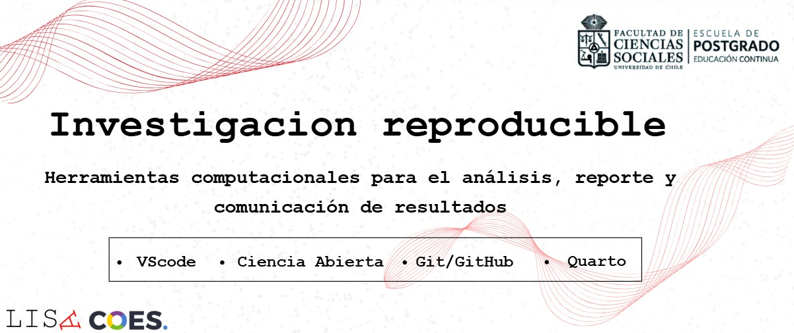
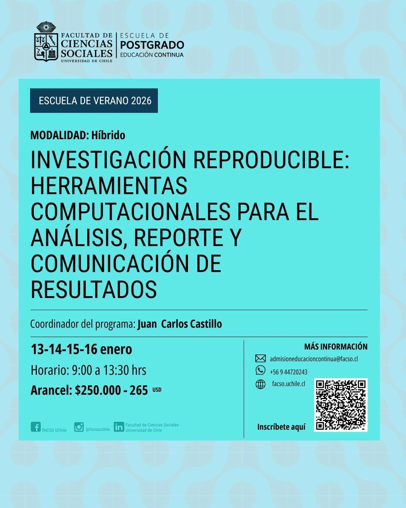

::: {.post-hero style="--hero-edge: 160px; --hero-scale: 0.90;--hero-gap: 36px;"}
{.post-hero-img}
:::

::: {.post-meta-row}
::: {.post-actions}
[**Ficha del curso**](https://uchile.cl/s234561){.btn .btn-primary .btn-sm target="_blank" rel="noopener"}
[Postulación en línea](https://lnkd.in/eZr_dQYN){.btn .btn-outline-secondary .btn-sm target="_blank" rel="noopener"}
:::

::: {.post-date}

:::
:::

El Departamento de Sociología de la Facultad de Ciencias Sociales de la Universidad de Chile invita a participar en el curso de especialización “Investigación reproducible: Herramientas computacionales para el análisis, reporte y comunicación de resultados”, parte de la Escuela de Verano 2026 de Educación Continua.

El curso aborda el uso integrado de **Visual Studio Code**, **Markdown/Quarto** y **Git/GitHub** para organizar proyectos, documentar procesos y comunicar resultados de investigación de manera clara, transparente y reproducible. A través de casos y ejercicios prácticos, se trabaja el ciclo completo: desde la organización de carpetas y archivos hasta la generación de documentos dinámicos y la publicación en plataformas abiertas.

La actividad está dirigida a **profesionales, académicos, estudiantes, funcionariado público y trabajadores** que requieran fortalecer sus habilidades en análisis, reporte y presentación de datos para mejorar la calidad y trazabilidad de sus proyectos.

**Información general del curso**

- **Fechas:** martes 13, miércoles 14, jueves 15 y viernes 16 de enero de 2026  
- **Horario:** 09:00 a 13:30 horas  
- **Modalidad:** Híbrida (clases por Zoom y en aula física)  
- **Organiza:** Departamento de Sociología, FACSO – Universidad de Chile  
- **Valor de referencia:** $250.000 CLP (aprox. 265 USD)  

El curso contempla clases teórico–participativas, discusión de experiencias y trabajo aplicado sobre repositorios reales, buscando que cada participante pueda adaptar las herramientas a sus contextos de investigación y docencia. Al finalizar, quienes aprueben obtendrán **certificación como Curso de Especialización de la Universidad de Chile**.

Para más detalles de contenidos, requisitos y proceso de postulación, revisa la ficha oficial del curso y completa tu postulación en los enlaces destacados al inicio de esta nota.

:::{.figure-plain}

:::

