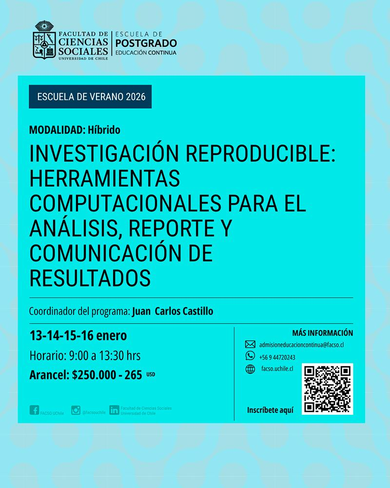

::: {.post-meta-row}
::: {.post-actions}
[**Ficha del curso**](https://uchile.cl/s234561){.btn .btn-primary .btn-sm target="_blank" rel="noopener"}
[Postulación en línea](https://econtinua.facso.cl/vistas/formulario.php?prog=NjM=){.btn .btn-outline-secondary .btn-sm target="_blank" rel="noopener"}
Contacto: **tomas.urzua@ug.uchile.cl**
:::

::: {.post-date}

:::
:::

::: {.flyer-wrap}
{.flyer-inline fig-alt="Afiche Escuela de Verano 2026: Investigación reproducible"}
:::

##

El Departamento de Sociología de la Facultad de Ciencias Sociales de la Universidad de Chile invita a participar en el curso de especialización **“Investigación reproducible: Herramientas computacionales para el análisis, reporte y comunicación de resultados”**, parte de la **Escuela de Verano 2026 de Educación Continua**.

## Público objetivo

El curso está dirigido a **profesionales, académicos, estudiantes, funcionariado público y trabajadores** que necesiten fortalecer sus habilidades en análisis, reporte y presentación de datos para mejorar la calidad, transparencia y trazabilidad de sus proyectos. Se orienta especialmente a quienes desarrollan investigación social, análisis de datos, evaluación de políticas públicas, estudios de mercado o proyectos relacionados con ciencias sociales, salud, educación y áreas afines. No se requieren conocimientos previos en programación, pero si es recomendable tener experiencia básica en análisis de datos con programas basados en código (R, Python, Stata, etc.).

## Contenidos principales

- **Visual Studio Code (VSC)**  
  VSC es un editor ampliamente utilizado en los últimos años y que sirve para escribir texto y código, y analizar datos en distintos lenguajes. Se revisan sus principales funcionalidades, extensiones y atajos de teclado para optimizar el flujo de trabajo en proyectos de análisis de datos e investigación reproducible.

- **Documentos dinámicos con Markdown y Quarto**  
  Introducción a Markdown como lenguaje de marcado sencillo para escribir texto estructurado (títulos, listas, énfasis) y combinarlo con código. A partir de esto, se trabaja con Quarto para crear documentos dinámicos como informes, reportes y presentaciones que se actualizan automáticamente cuando cambian los datos o el código, facilitando la coherencia entre análisis y resultados.

- **Control de versiones y publicación con Git/GitHub**  
  Revisión de los conceptos básicos de Git como sistema de control de versiones: guardar el historial de cambios, recuperar versiones anteriores y trabajar en paralelo en un mismo proyecto. Se explica el uso de GitHub como repositorio remoto para respaldar el trabajo, colaborar con otras personas y publicar productos reproducibles (informes, sitios web, materiales docentes) en plataformas abiertas.

## Información general

- **Fechas:** martes 13, miércoles 14, jueves 15 y viernes 16 de enero de 2026  
- **Horario:** 09:00 a 13:30 horas  
- **Modalidad:** Híbrida (clases por Zoom y en aula física)  
- **Organiza:** Departamento de Sociología, FACSO – Universidad de Chile  
- **Valor de referencia:** $250.000 CLP (aprox. 265 USD)  

El curso contempla clases teórico–participativas, discusión de experiencias y trabajo aplicado sobre repositorios reales, buscando que cada participante pueda adaptar las herramientas a sus contextos de investigación y docencia. Al finalizar, quienes aprueben obtendrán **certificación como Curso de Especialización de la Universidad de Chile**.

## Equipo

<table class="team-table">
  <tr>
    <td class="team-photo-cell">
      
      
Juan Carlos Castillo

      
Investigador Principal LISA

    </td>
    <td class="team-bio">
      Profesor titular del Departamento de Sociología de la Universidad de Chile, investigador principal del Núcleo Milenio en Desigualdades y Oportunidades Digitales (NUDOS), y del Centro de Estudios de Conflicto y Cohesión Social (COES), donde es investigador principal del Laboratorio de Investigación Social Abierta - LISA. Obtuvo su doctorado en Sociología en la Humboldt Universität zu Berlin.  

    </td>
  </tr>

  <tr>
    <td class="team-photo-cell">
      
      
Kevin Carrasco

      
Coordinador LISA

    </td>
    <td class="team-bio">
      Sociólogo y magíster en Ciencias Sociales de la Universidad de Chile. Actualmente, se desempeña como coordinador del Laboratorio de Investigación Social Abierta (LISA-COES), asistente de investigación de la línea “Interacciones grupales e individuales” de COES y como profesor de la cátedra “Métodos Estadísticos para las Ciencias Sociales III” de la Universidad Andrés Bello. Sus intereses de investigación incluyen desigualdad, justicia distributiva, ciencia abierta y métodos cuantitativos de investigación social.
    </td>
  </tr>

  <tr>
    <td class="team-photo-cell">
      
      
René Canales

      
Asistente de Investigación LISA

    </td>
    <td class="team-bio">
       Sociólogo de la Pontificia Universidad Católica y estudiante del Magíster en Sociología en la misma institución. Actualmente se desempeña como asistente de investigación en el Observatorio de Cohesión Social (COES) y en el Laboratorio de Investigación Social Abierta (LISA). Además, es tesista del proyecto FONDECYT “Actitudes y Comportamiento Juvenil” (1230922). Sus intereses incluyen la participación política, estratificación social, métodos cuantitativos y ciencia abierta.
    </td>
  </tr>

  <tr>
    <td class="team-photo-cell">
      
      
Katherine Aravena

      
Ayudante de Investigación LISA

    </td>
    <td class="team-bio">
      Estudiante de Sociología en la Universidad de Chile, asistente de investigación en el Centro de Estudios Públicos (CEP) -equipo de humanidades digitales C22- y asistente de proyecto en el Laboratorio de Investigación Social Abierta (LISA), iniciativa del Centro de Estudios de Conflicto y Cohesión Social (COES). Certificada por Duke University en análisis de datos, con experiencia en construcción y limpieza de bases, análisis cuantitativo  y elaboración de reportes reproducibles orientados a la toma de decisiones.
    </td>
  </tr>

 <tr>
    <td class="team-photo-cell">
      
      
Tomás Urzúa 

      
Asistente de Investigación OCS

    </td>
    <td class="team-bio">
      Sociólogo de la Universidad de Chile y estudiante del Magíster de Ciencias Sociales en la misma institución. Actualmente se desempeña como asistente de investigación en el Observatorio de Cohesión Social (COES), y en paralelo es tesista del proyecto FONDECYT  “Justicia de Mercado y merecimiento del bienestar social” (1250518). Sus intereses de investigación se centran en las relaciones entre educación y mercado, metodologías cuantitativas, y ciencia abierta.
    </td>
  </tr>

</table>

## Programa completo del curso

### 1. Introducción al análisis de datos reproducibles
   
  1.1 Apertura y reproducibilidad: Principios de la Ciencia Abierta

  1.2 Ética y eficiencia en el proceso de investigación

  1.3 Editores de código abierto: Acercamiento a Visual Studio Code

  1.4 Recomendaciones en VSC: Acciones, extensiones y shortcuts

### 2. Generación de documentos dinámicos

  2.1 Proyectos autocontenidos y organización de carpetas

  2.2 Funcionalidad del proyecto: funciones y rutas para la localización de datos

  2.3 Markdown/RMarkdown: creación de documentos con texto plano y código integrado

  2.4 Introducción a Quarto

### 3. Repositorios abiertos

  3.1 Relevancia de repositorios abiertos y proyectos colaborativos en el contexto de la investigación

  3.2 Git y GitHub: control de versiones

  3.3 Inducción práctica a Git y GitHub: Comprensión del workflow y sus conceptos asociados

  3.4 Generación de repositorios: uso aplicado de GitHub

### 4. Publicación de investigaciones reproducibles

  4.1 GitHub Pages y las ventajas de la publicación en plataformas abiertas

  4.2 Documentos reproducibles en Quarto

  4.3 Presentaciones en Quarto

  4.4 Profundización en Quarto: fundamentos aplicados para optimizar el flujo de trabajo en documentos dinámicos

  <iframe 
    src="Programa-Curso-EdV.pdf#view=FitH"
    width="100%"
    height="800px"
    style="border: 1px solid #e5e7eb; border-radius: 12px;">
  </iframe>

[Descargar programa del curso (PDF)](Programa-Curso-EdV.pdf){target="_blank" rel="noopener"}
